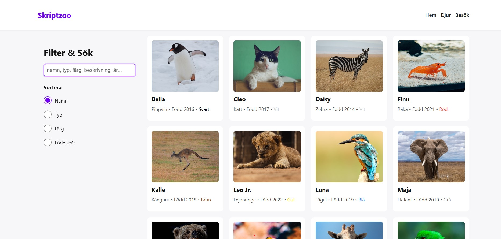

# Skriptzoo

A simple lab project for Medieinstitutet that demonstrates a fictional zoo with animal cards, search, and sorting. Built for practicing HTML, CSS, and vanilla JavaScript.

## Features

- Responsive design (flexbox layout for large screens, stacked cards for mobile)
- Search by name, type, color, description, or birth year
- Sorting by name or birth year
- Color-coded animal cards using CSS variables for easy customization
- Clickable cards to view detailed information in a modal/dialog
- Clean, semantic HTML structure
- Fully customizable styling via CSS variables
- Works on any web server; optional dev server with hot module replacement using Node.js

## Screenshots


## Deployment

This project can run on any web server as it is just HTML, CSS, and JavaScript.  
If you want Hot Module Replacement (HMR) and a live development experience, you can start a development server using Node.js:

```bash
npm run dev
```
## Authors

- [@santiagoaloi](https://www.github.com/santiagoaloi)

